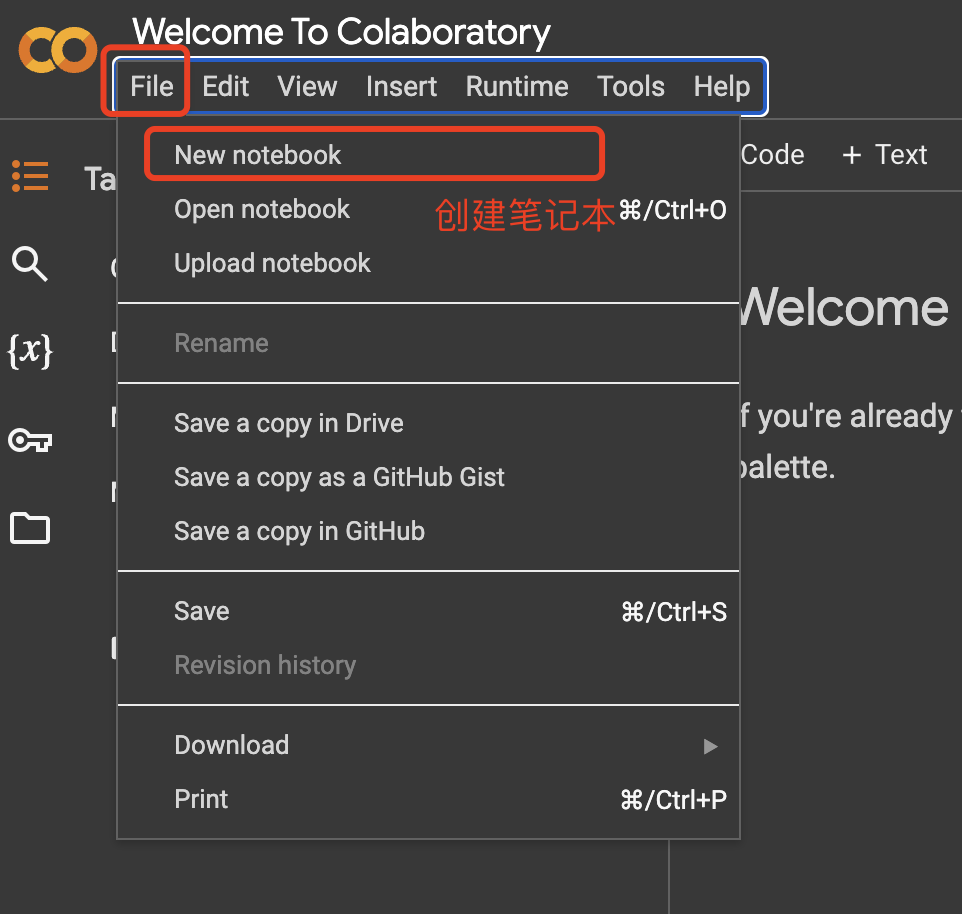
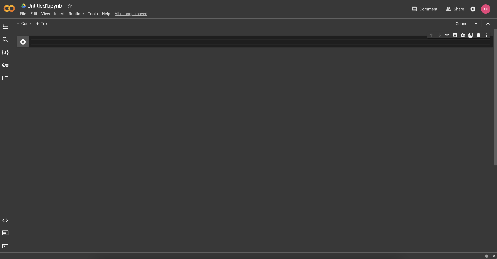
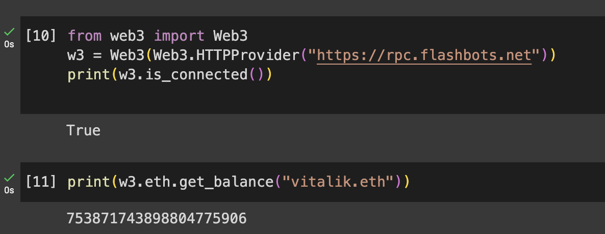

# web3.py极简入门: 1. HelloVitalik (6行代码)

我们最近在重新学`web3.py`，巩固一下细节，也写一个`WTF web3py极简入门`，供小白们使用。

**推特**：[@0xAA_Science](https://twitter.com/0xAA_Science)[0xXQ](https://twitter.com/0xXQ1)


**WTF Academy社群：** [官网 wtf.academy](https://wtf.academy) | [WTF Solidity教程](https://github.com/AmazingAng/WTFSolidity) | [discord](https://discord.gg/5akcruXrsk) | [微信群申请](https://docs.google.com/forms/d/e/1FAIpQLSe4KGT8Sh6sJ7hedQRuIYirOoZK_85miz3dw7vA1-YjodgJ-A/viewform?usp=sf_link)

所有代码和教程开源在github: [github.com/WTFAcademy/WTF-web3py](https://github.com/WTFAcademy/WTF-web3py)

-----

这一讲，我们会介绍`web3.py`库，python在线编辑器`colab`，并且我们会写第一个程序`HelloVitalik`：查询Vitalik的`ETH`余额，并输出在`console`中。

> 教程使用 web3.py 最新的 v6.11.4 版本。

## web3.py简述

`web3.py`适用于以太坊和 EVM 区块链的Python Web3 SDK，提供了许多方便实用的函数，支持开发者与以太坊主网进行便捷的交互。

## 开发工具

### 1. VScode + Jupyter Notebook

你可以使用本地`VScode`进行开发。你需要安装[Python](https://www.python.org/downloads/)，以及[Jupyter Notebook]()然后利用包管理工具`pip`安装`web3.py`库：

```shell
pip install web3
```

### 2. Colab


[colab](https://colab.research.google.com/)是一个在线`Python`编程的平台，你只需要有一个Google帐号，不需要配置`Python`环境就可以运行使用`Jupyter Notebook`运行`Python`代码。



这一讲，我们将用`colab`做演示。你需要有一个Google帐号并登录，然后点击`File > New Notebook`创建一个新项目，然后将代码写在自动生成的`Untitled1.ipynb`中即可。本地使用`VScode`的方法同理，相关配置方法请读者自行查阅资料。

`Jupyter Notebook`和`Colab`是一种交互式的编程环境，在这里代码被写在独立的Cell里并可以分步执行，适合对代码的逐步调试和修改。代码的运行结果也可以自动展示在Cell的输出部分中。运行独立的Cell可以通过选中Cell并点击运行按钮来运行，也可以使用快捷键`Shift+Enter`运行。


## HelloVitalik

现在，让我们用`web3.py`编写第一个程序`HelloVitalik`：查询Vitalik的`ETH`余额，并输出在NoteBook中。整个程序只需要4行，非常简单！

**注意**：在`Colab`上第一次运行可能会提示`ModuleNotFoundError: No module named 'web3'`，这是因为`web3.py`库还没有安装，只需要在任意一个Cell，输入下列指令运行安装即可。
```shell
pip install web3
```


```python
from web3 import Web3
w3 = Web3(Web3.HTTPProvider('https://rpc.ankr.com/eth'))
print(w3.is_connected())
print(w3.eth.get_balance("vitalik.eth"))
```

我们逐行分析这个程序：

### 1. 导入`web3.py`
第一行的作用是导入已经安装好的`web3.py`库：
```python
from web3 import Web3
```

### 2. 连接以太坊

在`web3.py`中，`Provider`类是一个为以太坊网络连接提供抽象的类，它提供对区块链及其状态的只读访问。`Provider`包括`Test Provider, Local Provider, Remote Provider`三种，这里我们初始化一个`HTTPProvider`用于连接以太坊网络。
`HTTPProvider`接收一个`String`类型的参数，用于指定`rpc`地址，这里我们使用的是以太坊主网的公共`rpc`。
完成`Provider`的创建后，我们使用`Provider`实例作为参数初始化一个`Web3`实例。`Web3`实例是与以太坊交互的入口，我们使用变量`w3`存储这个实例。


```python
w3 = Web3(Web3.HTTPProvider('https://rpc.ankr.com/eth'))
```

### 3. 测试链接状态

完成`Web3`实例的初始化后，我们需要测试实例是否能够成功连接到以太坊网络。`is_connected()`会返回一个布尔型变量，这里我们把他输出到控制台。返回为`True`代表连接成功。
```python
print(w3.is_connected())
```

### 4. 获取Vitalik地址的`ETH`余额

我们可以利用`Web3.eth`实例的`get_balance()`函数来查询某个地址的`ETH`余额。由于`web3.py`支持`ENS`域名，我们不需要知道具体地址，用`ENS`域名`vitalik.eth`就可以查询到以太坊创始人豚林-vitalik的余额。

```python
print(w3.eth.get_balance("vitalik.eth"))
```





## 总结

这是WTF web3.py极简教程的第一讲，我们介绍了`web3.py`，并完成了第一个使用`web3.py`的程序`HelloVitalik`，查询Vitalik钱包的`ETH`余额。

**课后作业**：在第四步里我们获取了Vitalik地址的`ETH`余额，有没有合适的方法可以把输出的单位转化为`ETH`呢？

web3.py官方文档：https://web3py.readthedocs.io/en/stable/index.html
