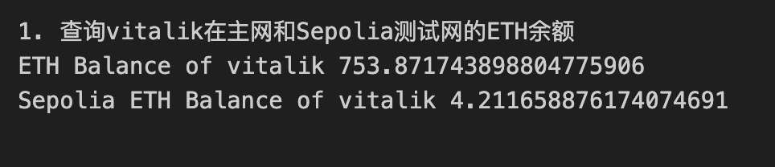
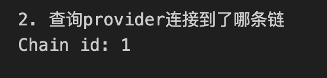
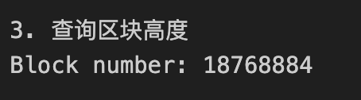
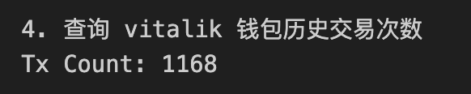
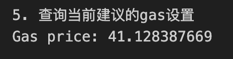
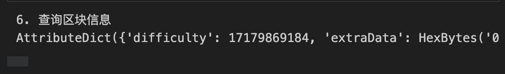
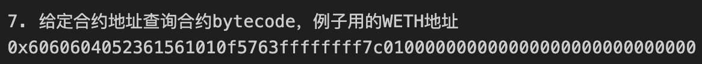

# Ethers极简入门: 2. Provider 提供器

我们最近在重新学`web3.py`，巩固一下细节，也写一个`WTF web3py极简入门`，供小白们使用。

**推特**：[@0xAA_Science](https://twitter.com/0xAA_Science)[0xXQ](https://twitter.com/0xXQ1)


**WTF Academy社群：** [官网 wtf.academy](https://wtf.academy) | [WTF Solidity教程](https://github.com/AmazingAng/WTFSolidity) | [discord](https://discord.gg/5akcruXrsk) | [微信群申请](https://docs.google.com/forms/d/e/1FAIpQLSe4KGT8Sh6sJ7hedQRuIYirOoZK_85miz3dw7vA1-YjodgJ-A/viewform?usp=sf_link)

所有代码和教程开源在github: [github.com/WTFAcademy/WTF-web3py](https://github.com/WTFAcademy/WTF-web3py)

-----

这一讲，我们将介绍web3.py的`Provider`类，然后利用它连接上Infura节点，读取链上的信息。

## `Provider`类

`Provider`类是对以太坊网络连接的抽象，为标准以太坊节点功能提供简洁、一致的接口。`Provider`是 `web3.py` 与区块链通信的方式。提供者接受 `JSON-RPC` 请求并返回响应。这通常是通过将请求提交到基于 `HTTP` 或 `IPC` 套接字的服务器来完成的。

## `HTTPProvider`

### 创建节点服务商的API Key

首先，你需要去节点服务商的网站注册并创建`API Key`。在`WTF Solidity极简教程`的工具篇，我们介绍了[Infura](https://github.com/AmazingAng/WTFSolidity/blob/main/Topics/Tools/TOOL02_Infura/readme.md)和[Alchemy](https://github.com/AmazingAng/WTFSolidity/blob/main/Topics/Tools/TOOL04_Alchemy/readme.md)两家公司`API Key`的创建方法，大家可以参考。


你还可以在 [Chainlist](https://chainlist.org/) 网站找到各个链的公开节点。

### 连接公开节点

这里，我们用[Chainlist](https://chainlist.org/)上的公开节点作为例子。在找到合适的rpc之后，可以利用`Web3.HTTPProvider()`方法来创建`Provider`变量，该方法以节点服务的`url`链接作为参数。

在下面这个例子中，我们分别创建连接到`ETH`主网和`Sepolia`测试网的`provider`，并构建响应的`Web3`实例：

```python
    # 利用公共rpc节点连接以太坊网络
    # 可以在 https://chainlist.org 上找到
    from web3 import Web3
    ALCHEMY_MAINNET_URL = 'https://rpc.ankr.com/eth'
    ALCHEMY_SEPOLIA_URL = 'https://rpc.sepolia.org'
    # 连接以太坊主网
    provider_main = Web3.HTTPProvider(ALCHEMY_MAINNET_URL)
    # 连接Sepolia测试网
    provider_test = Web3.HTTPProvider(ALCHEMY_SEPOLIA_URL)
    w3_main = Web3(provider_main)
    w3_test = Web3(provider_test)
```

### 利用`Web3.eth`实例读取链上数据

`Web3.eth`实例封装了一些方法，可以便捷的读取链上数据：

**1.** 利用`get_balance()`函数读取主网和测试网Vitalik的`ETH`余额，并且使用`Web3.from_wei()`函数将返回的结果转化为`ETH`单位：

```python
    # 1. 查询vitalik在主网和Sepolia测试网的ETH余额
    print("1. 查询vitalik在主网和Sepolia测试网的ETH余额")
    balance_main = w3_main.eth.get_balance("vitalik.eth")
    balance_test = w3_test.eth.get_balance("vitalik.eth")
    # 将余额输出在console（主网）
    print("ETH Balance of vitalik",w3_main.from_wei(balance_main,'ether'))
    # 输出Sepolia测试网ETH余额
    print("Sepolia ETH Balance of vitalik",w3_test.from_wei(balance_test,'ether'))
```



**2.** 利用`chain_id`属性查询`provider`连接到了哪条链：

```python
    # 2. 查询provider连接到了哪条链
    print("2. 查询provider连接到了哪条链")
    chain_id_main = w3_main.eth.chain_id
    print(f"Chain id: {chain_id_main}")
```



**3.** 利用`block_number`属性查询当前区块高度：

```python
    # 3. 查询区块高度
    print("3. 查询区块高度")
    block_number_main = w3_main.eth.block_number
    print(f"Block number: {block_number_main}")
```



**4.** 利用`get_transaction_count()`查询某个钱包的历史交易次数。

```python
    # 4. 查询 vitalik 钱包历史交易次数
    print("4. 查询 vitalik 钱包历史交易次数")
    tx_count_main = w3_main.eth.get_transaction_count("vitalik.eth")
    print(f"Tx Count: {tx_count_main}")
```




**5.** 利用`gas_price`属性查询当前建议的`gas`设置，并以`gwei`为单位返回。

```python
    # 5. 查询当前建议的gas设置
    print("5. 查询当前建议的gas设置")
    fee_data_main = w3_main.eth.gas_price
    print(f"Gas price: {w3_main.from_wei(fee_data_main, 'gwei')}")
```



**6.** 利用`get_block()`查询区块信息，参数为要查询的区块高度：

```python
    # 6. 查询区块信息
    print("6. 查询区块信息")
    block_main = w3_main.eth.get_block(0)
    print(block_main)
```



**7.** 利用`get_code()`查询某个地址的合约`bytecode`，参数为合约地址，下面例子中用的主网`WETH`的合约地。注意，这里的合约地址需要将地址使用`Web3.to_checksum_address()`转化为校验和地址：

```python
    # 7. 给定合约地址查询合约bytecode，例子用的WETH地址
    print("7. 给定合约地址查询合约bytecode，例子用的WETH地址")
    weth_address = w3_main.to_checksum_address("0xc778417e063141139fce010982780140aa0cd5ab")
    code_main = w3_main.eth.get_code(weth_address)
    print(code_main.hex())
```



## 总结

这一讲，我们介绍了`web3.py`的`Provider`类，并用Infura的节点API Key创建了`HTTPProvider`，读取了`ETH`主网和`Sepolia`测试网的链上信息。