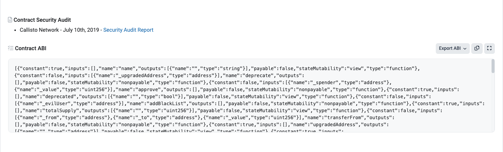
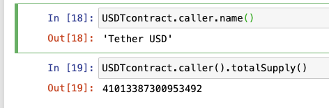
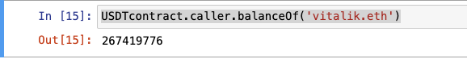

# web3.py极简入门: 3.读取合约信息

我们最近在重新学`web3.py`，巩固一下细节，也写一个`WTF web3.py极简入门`，供小白们使用。

**推特**：[@0xAA_Science](https://twitter.com/0xAA_Science)[@localcat15](https://twitter.com/localcat15)


**WTF Academy社群：** [官网 wtf.academy](https://wtf.academy) | [WTF Solidity教程](https://github.com/AmazingAng/WTFSolidity) | [discord](https://discord.gg/5akcruXrsk) | [微信群申请](https://docs.google.com/forms/d/e/1FAIpQLSe4KGT8Sh6sJ7hedQRuIYirOoZK_85miz3dw7vA1-YjodgJ-A/viewform?usp=sf_link)

所有代码和教程开源在github: [github.com/WTFAcademy/WTF-web3py](https://github.com/WTFAcademy/WTF-web3py)

-----

这一讲，我们会介绍`Contract`合约对象，并利用它来读取链上的合约信息。

## `Contract`对象

在`web3.py`中，`Contract`对象是对区块链上运行的智能合约的抽象，将智能合约实例化为`Contract`对象后，我们就可以在`python`程序中方便地与之进行交互。

## 创建`Contract`变量
创建以太坊上的`Contract`对象非常简单，只需要借助`web3.eth.contract()`方法。想要调用这个方法，我们必须有一个预先创建好的`Provider`实例，并将合约地址和合约`ABI`作为参数传入。

合约的`ABI`指定了如何与合约进行交互，可以在我们编译合约文件时获得，也可以通过[以太坊浏览器](https://etherscan.io/)方便的读取。

## 读取合约信息

接下来，我们尝试借助`Contract`对象读取Vitalik的`USDT`持仓。

### 1. 创建Provider
```python
from web3 import Web3
#从alchemy申请rpc节点
ALCHEMY_URL='https://eth-mainnet.g.alchemy.com/v2/hjZ-SwVhjRtBk-yUJ1SkWSTrz_dJl7of'
w3=Web3(Web3.HTTPProvider(ALCHEMY_URL))
w3.is_connected()
```

### 2. 创建`Contract`实例
```python
#USDT主网地址
addressUSDT=0xdAC17F958D2ee523a2206206994597C13D831ec7
#从etherscan找到USDT的ABI
ABIUSDT='[{"constant":true,"inputs":[],...}]'
```

### 3. 调用只读函数
可以使用`Contract.caller`方法简单地实现合约中只读函数的调用（涉及到签名和发送交易的调用将在后续章节讨论），以下两种调用方式都符合语法要求。
```python
#第一种
USDTcontract.caller.name()
#第二种
USDTcontract.caller().totalSupply()

```

### 4. 获取Vitalik地址的`USDT`余额

我们可以利用`USDTcontract`合约的`balanceOf`函数来查询Vitalik的`USDT`余额。

```python
USDTcontract.caller.balanceOf('vitalik.eth')
```





## 总结
这一讲，我们介绍了如何在`web3.py`中创建合约实例，并调用合约中的只读函数读取了Vitalik的USDT余额。