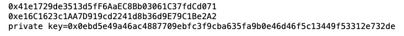
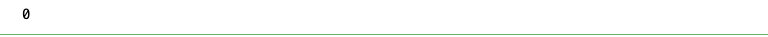
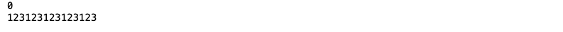

# web3.py极简入门: 4、发送ETH

我们最近在重新学`web3.py`，巩固一下细节，也写一个`WTF web3.py极简入门`，供小白们使用。

**推特**：[@0xAA_Science](https://twitter.com/0xAA_Science)[@localcat15](https://twitter.com/localcat15)


**WTF Academy社群：** [官网 wtf.academy](https://wtf.academy) | [WTF Solidity教程](https://github.com/AmazingAng/WTFSolidity) | [discord](https://discord.gg/5akcruXrsk) | [微信群申请](https://docs.google.com/forms/d/e/1FAIpQLSe4KGT8Sh6sJ7hedQRuIYirOoZK_85miz3dw7vA1-YjodgJ-A/viewform?usp=sf_link)

所有代码和教程开源在github: [github.com/WTFAcademy/WTF-web3py](https://github.com/WTFAcademy/WTF-web3py)

-----

这一讲，我们会介绍`Account`钱包对象，并学习如何签名并发送交易。

## 创建`Account`对象

在`web3.py`中，`Account`对象是对以太坊账户的抽象，可用于对交易进行签名，并将签名后的交易发送到以太坊。

创建以太坊上的`Account`对象有以下几种方法：
### 方法1：生成随机密钥
```python
# 创建随机的account对象
generated_account = w3.eth.account.create()
```
### 方法2：导入已有私钥
```python
# 从已有密钥中生成
# 注意：不建议铭文编码私钥，更安全的方式是从系统环境变量中读取
generated_account = w3.eth.account.from_key("0x227dbb8586117d55284e26620bc76534dfbd2394be34cf4a09cb775d593b6f2b")
```
### 方法3：导入已有助记词
```python
# 借助已有助记词生成
generated_account = w3.eth.account.from_mnemonic(mnemonic)
```
## 发送ETH

我们可以利用Account实例来发送ETH。首先我们要构造一个交易请求，需要指定发送方、接收方和发送数量三个参数：
```python
tx_hash = w3.eth.send_transaction({
    "from": acct1,
    "to": some_address,
    "value": 123123123123123
})
```
注意：上述语法只对测试场景有效（即使用`EthereumTesterProvider`的场景），在测试账户中，签名过程会被自动完成。

如果想要在正式场景中发送交易，我们还需要补充签名的过程：
```python
# 1. Build a new tx
transaction = {
    'from': acct2.address,
    'to': some_address,
    'value': 1000000000,
    'nonce': w3.eth.get_transaction_count(acct2.address),
    'gas': 200000,
    'maxFeePerGas': 2000000000,
    'maxPriorityFeePerGas': 1000000000,
}
# 2. Sign tx with a private key
signed = w3.eth.account.sign_transaction(transaction, private_key)
# 3. Send the signed transaction
tx_hash = w3.eth.send_raw_transaction(signed.rawTransaction)
tx = w3.eth.get_transaction(tx_hash)
assert tx["from"] == acct2.address
```
此外，对于一个经常使用的账户，我们也可以在正式场景中设置自动签名：
```python
# Add acct2 as auto-signer:
w3.middleware_onion.add(construct_sign_and_send_raw_middleware(acct2))
# pk also works: w3.middleware_onion.add(construct_sign_and_send_raw_middleware(pk))

# Transactions from `acct2` will then be signed, under the hood, in the middleware:
tx_hash = w3.eth.send_transaction({
    "from": acct2.address,
    "value": 3333333333,
    "to": some_address
})
```
## 代码示例
### 1、创建`Provider`实例
```python
from web3 import Web3,EthereumTesterProvider
w3 = Web3(EthereumTesterProvider)
w3.is_connected()
```

### 2. 创建`Account`实例
```python
account1 = w3.eth.account.create()
account2 = w3.eth.account.from_key("0x227dbb8586117d55284e26620bc76534dfbd2394be34cf4a09cb775d593b6f2b")
```
### 3. 获取钱包地址或私钥

```python
print(account1.address)
print(account2.address)
print(f'private key={w3.to_hex(account1.key)}')
```

### 4. 获取钱包在链上的交互次数
```python
print(w3.eth.get_transaction_count(account2.address))
```


### 5、发送以太坊
```python
print(w3.eth.get_balance(account1.address))
# account3是充值了测试ETH的测试账户:
account3 = w3.eth.accounts[0]
tx_hash = w3.eth.send_transaction({
    "from": account3,
    "to": account1.address,
    "value": 123123123123123
})
print(w3.eth.get_balance(account1.address))
```





## 总结
这一讲，我们介绍了如何在`web3.py`中创建钱包实例，并借助钱包签名并发送交易。