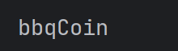
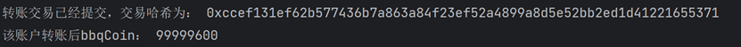

# web3py极简入门: 5. 合约交互


**WTF Academy社群：** [官网 wtf.academy](https://wtf.academy) | [WTF Solidity教程](https://github.com/AmazingAng/WTF-Solidity) | [discord](https://discord.gg/5akcruXrsk) | [微信群申请](https://docs.google.com/forms/d/e/1FAIpQLSe4KGT8Sh6sJ7hedQRuIYirOoZK_85miz3dw7vA1-YjodgJ-A/viewform?usp=sf_link)

-----

这一讲，我们将介绍如何声明`Contract`合约变量，并利用它与测试网的`BBQ`合约交互。

## 创建`Contract`变量

声明`Contract`变量的规则：
```py
contract= w3.eth.contract(address=contract_address, abi=contract_abi)
```

其中`contract_address`为合约地址，`contract_abi`是合约的`abi`接口，`w3`为我们先前选取的`provider`。


## 合约交互

我们在第三讲介绍了读取合约信息。它不需要`gas`。这里我们介绍写入合约信息，你需要构建交易，并且支付`gas`。该交易将由整个网络上的每个节点以及矿工验证，并改变区块链状态。

你可以用下面的方法进行合约交互：

```py
# 从账户私钥创建交易
private_key = '0x你的私钥'
account = Account.privateKeyToAccount(private_key)

# 构建交易参数
transaction = contract.functions.METHOD_NAME(args).buildTransaction({
    'gas': 2000000,  # gas上限
    'gasPrice': web3.toWei('50', 'gwei'),  # gas价格
    'nonce': web3.eth.getTransactionCount(account.address),  # nonce
    'value': web3.toWei(1, 'ether')  # 传入的ether（单位是wei）
})

# 签名交易
signed_txn = web3.eth.account.sign_transaction(transaction, private_key)

# 发送交易
tx_hash = web3.eth.send_raw_transaction(signed_txn.rawTransaction)

# 等待链上确认交易
receipt = web3.eth.wait_for_transaction_receipt(tx_hash)
print(receipt)
```

其中`METHOD_NAME`为调用的函数名，`args`为函数参数，`buildTransaction` 是用于构建交易对象的方法。它接受一个包含交易参数的字典，并返回一个表示待发送交易的字典。这个字典包含了交易的各种参数，包括：
- gasPrice：gas价格
- gasLimit：gas上限
- value：调用时传入的ether（单位是wei）
- nonce：nonce

## 实例：与bsc测试网`BBQ`合约交互

BBQ合约是我借鉴了uang合约重新在bsc测试网部署的一个土狗合约，它整体采用ERC20协议，并发行了自己的代币bbqCoin,拥有查询余额，转账等基本功能。

1. 创建`provider`，`wallet`变量。

    ```py
    from web3 import Web3
    from eth_account import Account
    #连接bsc测试网
    bsc_test=Web3(Web3.HTTPProvider('https://data-seed-prebsc-1-s1.binance.org:8545'))

    // 利用私钥创建wallet对象
    private_key = "e08ca922fedbc3d37fa677f1d8f7e8fcbe42d031186bcbbc763d20cbdac81f9d"

    # 创建钱包对象
    private_key = "e08ca922fedbc3d37fa677f1d8f7e8fcbe42d031186bcbbc763d20cbdac81f9d"
    # 创建钱包对象
    wallet = Account.from_key(private_key)
    # 定义钱包地址
    address =wallet.address
    ```
2. 创建`BBQ`合约变量，我们在`ABI`中加入了4个我们要调用的函数：
    - `symbol`:是ERC20代币合约中的一个标准函数，用于返回代币的缩写符号。
    - `balanceOf(address)`：查询地址的`bbqCoin`余额。
    - `transfer(adress, uint256)`：转账。
    ```py
   # WETH的ABI
    contract_abi = [
    {
        "inputs": [],
        "name": "symbol",
        "outputs": [
            {
                "internalType": "string",
                "name": "",
                "type": "string"
            }
        ],
        "stateMutability": "view",
        "type": "function"},
    {

        "inputs": [
            {
                "internalType": "address",
                "name": "account",
                "type": "address"
            }
        ],
        "name": "balanceOf",
        "outputs": [
            {
                "internalType": "uint256",
                "name": "",
                "type": "uint256"
            }
        ],
        "stateMutability": "view",
        "type": "function"
    },
    {
        "inputs": [
            {
                "internalType": "address",
                "name": "recipient",
                "type": "address"
            },
            {
                "internalType": "uint256",
                "name": "amount",
                "type": "uint256"
            }
        ],
        "name": "transfer",
        "outputs": [
            {
                "internalType": "bool",
                "name": "",
                "type": "bool"
            }
        ],
        "stateMutability": "nonpayable",
        "type": "function"
    }
    ]

    # BBQ合约地址（bsc测试网）
    addressWETH = '0x2faf6cc1165e4d8a4aa28582c268d9a15f71ecb7'
    # 将地址转换为检验和格式
    checksum_address = w3.to_checksum_address(addressWETH)
    # 创建合约对象
    contract_bbq = bsc_test.eth.contract(address=checksum_contract_address_test, abi=contract_abi)
    ```
3. 调用合约本身的`symbol()`函数，展示合约代币的简写形式。
   ```py
   info=contract_bbq.functions.symbol().call()
   print(info)
    ```
    
4. 读取账户此时的`bbqCoin`余额，可以看到`bbqCoin`余额为`99999700`。

    ```py
    #调用函数读取
    balance_bbq = contract_bbq.functions.balanceOf(address).call()
    #转换余额的单位
    balance_bbq = Web3.from_wei(balance_bbq, 'ether')

    print('该账户bbqCoin：', balance_bbq)
    ```

    


5. 调用`BBQ`合约的`transfer()`函数，给一个账户转账`100 bbqCoin`，并打印余额。可以看到余额变为`99999600`。

    ```py
    # 指定转账目标地址和转账金额
    recipient_address = '0x19AbF5261c1a8a7882Ba8bE2F554C17C5036E94C'
    amount_in_ether = 100
    # 指定转账参数
    nonce = bsc_test.eth.get_transaction_count(address)
    gas_price = bsc_test.eth.gas_price
    gas_limit = 100000
    tx = contract_bbq.functions.transfer(recipient_address, Web3.to_wei(amount_in_ether, 'ether')).build_transaction(
        {
            'from': address,
            'nonce': nonce,
            'gasPrice': gas_price,
            'gas': gas_limit
        })

    # 使用钱包对象进行交易签名
    signed_txn = wallet.sign_transaction(tx)

    tx_hash = bsc_test.eth.send_raw_transaction(signed_txn.rawTransaction)

    print('转账交易已经提交，交易哈希为：', tx_hash.hex())
    balance_bbq = contract_bbq.functions.balanceOf(address).call()
    balance_bbq = Web3.from_wei(balance_bbq, 'ether')

    print('该账户转账后bbqCoin：', balance_bbq)

    ```
    


## 总结

这一讲，我们介绍了如何声明可写的`Contract`合约变量，并利用它与测试网的`BBQ`合约交互。我们不仅调用`BBQ`的`balanceOf()`函数，查询账户的bbqCoin余额，并将利用`transfer()`函数转账给另一个账户。