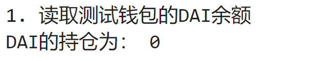
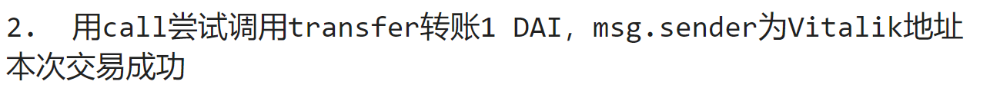
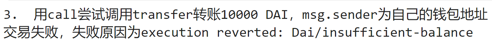

# Web3py极简入门: 11. StaticCall

我最近在重新学 `web3.py`，巩固一下细节，也写一个 `WTF web3py极简入门`，供小白们使用。

**推特**：[@0xAA_Science](https://twitter.com/0xAA_Science)

**WTF Academy社群：** [官网 wtf.academy](https://wtf.academy) | [WTF Solidity教程](https://github.com/AmazingAng/WTFSolidity) | [discord](https://discord.gg/5akcruXrsk) | [微信群申请](https://docs.google.com/forms/d/e/1FAIpQLSe4KGT8Sh6sJ7hedQRuIYirOoZK_85miz3dw7vA1-YjodgJ-A/viewform?usp=sf_link)

所有代码和教程开源在github: [github.com/WTFAcademy/WTF-web3py](https://github.com/WTFAcademy/WTF-web3py)

---

这一讲，我们将介绍合约函数类`ContractFunction`的`call`方法，用该方法在发送交易之前检查交易是否会失败，可以节省大量gas。

在[web3py极简入门: 5. 合约交互](https://github.com/WTFAcademy/WTF-web3py/tree/main/05%20_WriteContract)中，已经使用过`call`函数进行`view`函数的调用，本节主要利用该方法进行非`pure/view`函数的调用。

## 以太坊节点的 `eth_call`方法

在调用以太坊上的智能合约时，凡是利用链上资源进行计算的操作，都需要支付相应的gas，即使调用失败，费用也不会退还。

因此，我们在进行转账等操作时，最好先在本地模拟转账操作，以减少因调用失败而造成的gas损失。

以太坊节点提供了 `eth_call`方法，可以在不发送交易（不消耗gas费）的情况下，模拟合约调用的结果，从而检查合约调用是否会失败。

`web3.py`中的 `ContractFunction.call`、`ContractFunction.estimate_gas`、`Contract.fallback.call`等都是基于 `eth_call`API实现的。

## `call`

`call`方法的具体调用方式如下：

```python
合约实例.functions.函数名(参数).call(transaction, block_identifier)
```

- 函数名：为模拟调用的函数名。
- 参数：为合约中被调用函数的参数。
- transaction：选填，可以包含以下参数：
  - `from`：执行时的 `msg.sender`，可以是任何人的地址，形式可以是 `bytes`、`checksum address`或 `ENS name`。
  - `value`：执行时的 `msg.value`。
  - `gas`
  - `maxFeePerGas`
  - `gasPrice`
  - `nonce`
  - `maxPriorityFeePerGas`
- block_identifier: 选填，为模拟执行时的区块高度，默认值为 `"latest"`。

如果函数调用成功，将返回函数本身的返回值；如果函数调用失败，它将抛出异常。

## 用 `call`模拟 `DAI`转账

1. 创建 `Provider`。

   ```python
   from web3 import Web3
   from ens import ENS
   # 准备 alchemy API 
   # 可以参考https://github.com/AmazingAng/WTFSolidity/blob/main/Topics/Tools/TOOL04_Alchemy/readme.md 
   ALCHEMY_MAINNET_URL = 'https://eth-mainnet.g.alchemy.com/v2/oKmOQKbneVkxgHZfibs-iFhIlIAl6HDN'
   Provider = Web3(Web3.HTTPProvider(ALCHEMY_MAINNET_URL))
   Provider.is_connected()
   # 创建以太坊域名服务对象，用于获取vitalk.eth的地址
   ns = ENS.from_web3(Provider)
   ```
2. 创建钱包 ``wallet``对象

   ```PYTHON
   from eth_account import Account
   private_key = "0x227dbb8586117d55284e26620bc76534dfbd2394be34cf4a09cb775d593b6f2b"
   wallet = Account.from_key(private_key)
   ```
3. 创建 `DAI`合约对象。

   ```PYTHON
   # DAI合约地址
   AddressDAI = Provider.to_checksum_address("0x6B175474E89094C44Da98b954EedeAC495271d0F")
   # DAI合约的abi，只包含后续调用的transfer和balanceOf方法
   abiDAI = [
       {
           "inputs": [
               {"internalType": "address", "name": "dst", "type": "address"},
               {"internalType": "uint256", "name": "wad", "type": "uint256"},
           ],
           "name": "transfer",
           "outputs": [{"internalType": "bool", "name": "", "type": "bool"}],
           "stateMutability": "nonpayable",
           "type": "function",
       },
       {
           "inputs": [{"internalType": "address", "name": "", "type": "address"}],
           "name": "balanceOf",
           "outputs": [{"internalType": "uint256", "name": "", "type": "uint256"}],
           "stateMutability": "view",
           "type": "function",
       }
   ]
   # 创建DAI合约实例
   contractDAI = Provider.eth.contract(address = AddressDAI, abi = abiDAI)
   ```
4. 查看钱包中 `DAI`余额，为0。

   ```PYTHON
   # 获取钱包地址
   address = wallet.address
   print("1. 读取测试钱包的DAI余额")
   balanceDAI = contractDAI.caller.balanceOf(address)
   print("DAI的持仓为：", balanceDAI)
   ```

   
5. 用 `call`调用 `transfer()`函数，将 `from`参数填为Vitalik地址，模拟Vitalik转账 `1 DAI`。这笔交易将成功，因为Vitalik钱包有充足的 `DAI`。

   ```PYTHON
   print("2.  用call尝试调用transfer转账1 DAI，msg.sender为Vitalik地址")
   try:
       tx = contractDAI.functions.transfer(ns.address("vitalik.eth"),Provider.to_wei(1,'ether')).call({"from":ns.address("vitalik.eth")})
       print(f"本次交易{'成功' if tx else '失败'}")
   except Exception as error:
       print(f"交易失败，失败原因为{error}")
   ```

   
6. 用 `call`调用 `transfer()`函数，将 `from`参数填为测试钱包地址，模拟转账 `10000 DAI`。这笔交易将失败，报错，并返回原因 `Dai/insufficient-balance`。

   ```PYTHON
   print("3.  用call尝试调用transfer转账10000 DAI，msg.sender为自己的钱包地址")
   try:
       tx = contractDAI.functions.transfer(ns.address("vitalik.eth"),Provider.to_wei(10000,'ether')).call({"from":address})
       print(f"本次交易{'成功' if tx else '失败'}")
   except Exception as error:
       print(f"交易失败，失败原因为{error}")
   ```

   

## 总结

本节介绍如何通过 `call`方法在本地模拟合约函数调用，它利用了以太坊节点的 `eth_call`API，不在链上创建新的交易，因此无gas费消耗。
