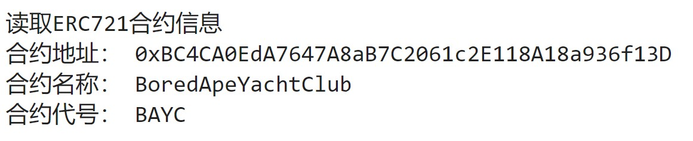
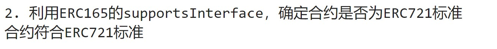

# web3py极简入门: 12. 识别ERC721合约

我最近在重新学 `web3.py`，巩固一下细节，也写一个 `WTF web3py极简入门`，供小白们使用。

**推特**：[@0xAA_Science](https://twitter.com/0xAA_Science)

**WTF Academy社群：** [官网 wtf.academy](https://wtf.academy) | [WTF Solidity教程](https://github.com/AmazingAng/WTFSolidity) | [discord](https://discord.gg/5akcruXrsk) | [微信群申请](https://docs.google.com/forms/d/e/1FAIpQLSe4KGT8Sh6sJ7hedQRuIYirOoZK_85miz3dw7vA1-YjodgJ-A/viewform?usp=sf_link)

所有代码和教程开源在github: [github.com/WTFAcademy/WTF-web3py](https://github.com/WTFAcademy/WTF-web3py)

---

这一讲，将介绍如何使用 `web3.py`识别一个合约是否为 `ERC721`标准。

## `ERC721`

`ERC721`是以太坊上流行的非同质化代币（NFT）标准，如果对这个标准不熟悉，可以阅读[WTF Solidity第34讲 ERC721](https://github.com/AmazingAng/WTFSolidity/blob/main/34_ERC721/readme.md)。在做NFT相关产品时，我们需要筛选出符合 `ERC721`标准的合约。例如Opensea，他会自动识别 `ERC721`，并爬下它的名称、代号、metadata等数据用于展示。要识别 `ERC721`，我们先要理解 `ERC165`。

## `ERC165`

通过[ERC165标准](https://eips.ethereum.org/EIPS/eip-165)，智能合约可以声明它支持的接口，供其他合约检查。因此，我们可以通过 `ERC165`来检查一个智能合约是不是支持了 `ERC721`的接口。

`IERC165`接口合约只声明了一个 `supportsInterface`函数，输入要查询的 `interfaceId`接口id（类型为 `bytes4`），若合约实现了该接口id，则返回 `true`；反之，则返回 `false`：

```solidity
interface IERC165 {
    /**
     * @dev 如果合约实现了查询的`interfaceId`，则返回true
     * 规则详见：https://eips.ethereum.org/EIPS/eip-165#how-interfaces-are-identified[EIP section]
     *
     */
    function supportsInterface(bytes4 interfaceId) external view returns (bool);
}
```

`ERC721`合约中会实现 `IERC165`接口合约的 `supportsInterface`函数，并且当查询 `0x80ac58cd`（`ERC721`接口id）时返回 `true`。

```solidity
   function supportsInterface(bytes4 interfaceId)
        external
        pure
        override
        returns (bool)
    {
        return
            interfaceId == type(IERC721).interfaceId 
    }
```

## 识别 `ERC721`

1. 创建 `provider`，连接以太坊主网。

   ```python
   from web3 import Web3
   # 准备 alchemy API 
   # 可以参考https://github.com/AmazingAng/WTFSolidity/blob/main/Topics/Tools/TOOL04_Alchemy/readme.md 
   ALCHEMY_MAINNET_URL = 'https://eth-mainnet.g.alchemy.com/v2/oKmOQKbneVkxgHZfibs-iFhIlIAl6HDN'
   Provider = Web3(Web3.HTTPProvider(ALCHEMY_MAINNET_URL))
   Provider.is_connected()
   ```
2. 创建 `ERC721`合约实例，在 `abi`接口中，我们声明要使用的 `name()`，`symbol()`，和 `supportsInterface()`函数即可，并且针对原始 `abi`进行了部分简化。这里我们用的BAYC的合约地址。

   ```python
   # ERC721的合约abi，只需要name、symbol、supportsInterface三个函数，这里对原始abi进行了简化
   abiERC721 = [
       {"inputs": [],"name": "name", "outputs": [{"type": "string"}], "stateMutability": "view", "type": "function"},
       {"inputs": [],"name": "symbol", "outputs": [{"type": "string"}], "stateMutability": "view", "type": "function"},
       {
           "inputs": [{"type": "bytes4"}],
           "name": "supportsInterface",
           "outputs": [{"type": "bool"}],
           "stateMutability": "view",
           "type": "function",
       }
   ]
   # ERC721的合约地址，这里使用BAYC
   addressBAYC = Provider.to_checksum_address("0xbc4ca0eda7647a8ab7c2061c2e118a18a936f13d")
   # 创建ERC721合约实例
   contractERC721 = Provider.eth.contract(address=addressBAYC, abi=abiERC721)
   ```
3. 读取合约的链上信息：名称和代号。

   ```python
   # 1. 读取ERC721合约的链上信息
   nameERC721 = contractERC721.caller.name()
   symbolERC721 = contractERC721.caller.symbol()
   print("读取ERC721合约信息")
   print("合约地址：", addressBAYC)
   print("合约名称：", nameERC721)
   print("合约代号：", symbolERC721)
   ```

   
4. 利用 `ERC165`的 `supportsInterface()`函数，识别合约是否为ERC721标准。如果是，则返回 `ture`；反之，则报错或返回 `false`。

   ```python
   # 2. 利用ERC165的supportsInterface，确定合约是否为ERC721标准
   # ERC721接口的ERC165 identifier
   selectorERC721 = "0x80ac58cd"
   isERC721 = contractERC721.caller.supportsInterface(selectorERC721)
   print("2. 利用ERC165的supportsInterface，确定合约是否为ERC721标准")
   print(f"合约{'符合' if isERC721 else '不符合'}ERC721标准")
   ```

   

## 总结

这一讲，我们介绍了如何利用 `web3.py`来识别一个合约是否为 `ERC721`。其中也利用了 `ERC165`标准，因此只有支持 `ERC165`标准的合约才能用这个方法识别，包括 `ERC721`，`ERC1155`等。但是像 `ERC20`这种不支持 `ERC165`的标准，就要用别的方法识别了。
