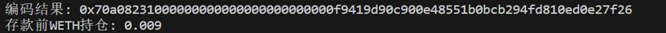
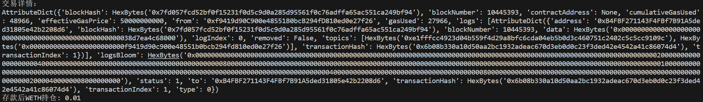

# web3.py极简入门: 13. 编码calldata

**WTF Academy社群：** [官网 wtf.academy](https://wtf.academy) | [WTF Solidity教程](https://github.com/AmazingAng/WTFSolidity) | [discord](https://discord.gg/5akcruXrsk) | [微信群申请](https://docs.google.com/forms/d/e/1FAIpQLSe4KGT8Sh6sJ7hedQRuIYirOoZK_85miz3dw7vA1-YjodgJ-A/viewform?usp=sf_link)


-----

这一讲，我们将介绍`web3.py`中的编码`calldata`。

## 编码方法 encodeABI

`web3.py`的合约提供了与以太坊网络上的合约交互所需的`ABI`编码功能`encodeABI()`。`ABI`（Application Binary Interface）与`API`类似，是一格式，用于对合约可以处理的各种类型的数据进行编码，以便它们可以交互。`encodeABI()` 是 `web3.py `中 `Contract` 类的一个类方法，用于根据给定的函数名（`fn_name`）和参数（`args`）使用以太坊` ABI `编码方式对参数进行编码。


```py
# 函数调用示例：
contract.encodeABI(fn_name="register", args=["rainbows", 10])
```

上面的代码将会返回一个字符串，这个字符串是根据传入的函数名和参数进行 ABI 编码后的结果。编码后的结果通常用于构建以太坊交易的 data 字段，以便执行合约中的函数调用。

## 例子：与测试网`WETH`合约交互

这里，我们利用编码`calldata`的方法，与测试网`WETH`合约进行合约交互。

1. 创建`provider`，`wallet`变量。

    ```py
    #连接到以太坊节点
    infura_url = "https://goerli.infura.io/v3/22b26b228b004ccc9325066db8b5c468"
    w3 = Web3(Web3.HTTPProvider(infura_url))

    # 判断连接是否成功
    if w3.is_connected():
        print("连接成功！")
    else:
        print("连接失败！")
    # 创建钱包对象
    private_key = "e08ca922fedbc3d37fa677f1d8f7e8fcbe42d031186bcbbc763d20cbdac81f9d"
    wallet = Account.from_key(private_key)
    ```

2. 创建`WETH`合约实例
    ```py
    # WETH合约地址（Goerli测试网）
    addressWETH = '0xb4fbf271143f4fbf7b91a5ded31805e42b2208d6'
    addressWETH=w3.to_checksum_address(addressWETH)
    abiWETH = [
        {"constant": True, "inputs": [{"name": "_owner", "type": "address"}], "name": "balanceOf", "outputs":[{"name": "", "type": "uint256"}], "payable": False, "stateMutability": "view", "type": "function"},
        {"constant": False, "inputs": [], "name": "deposit", "outputs": [], "payable": True, "stateMutability": "payable", "type": "function"}
    ]
    contract_instance = w3.eth.contract(address=addressWETH, abi=abiWETH)
    ```

3. 调用`balanceOf()`函数，读取钱包地址`address`的`WETH`余额。

    ```py
    # 编码查询余额调用数据
    data= contract_instance.encodeABI(fn_name="balanceOf", args=[wallet.address])
    print(f"编码结果: {data}")
    # 创建查询交易
    transaction = {
        "to": addressWETH,
        "data": data
    }

    # 发送交易并获取余额
    balanceWETH_hex = w3.eth.call(transaction)
    # 解码返回信息
    balanceWETH = int.from_bytes(balanceWETH_hex, byteorder='big')
    formatted_balance = w3.from_wei(balanceWETH, "ether")
    print(f"存款前WETH持仓: {formatted_balance}")
    ```
    

4. 调用`deposit()`函数，将`0.001 ETH`转换为`0.001 WETH`，打印交易详情和余额。可以看到余额变化。

    ```py
    # 编码余额转化调用数据
    data_deposit= contract_instance.encodeABI(
        "deposit",
        []
    )
    # 获取发送者地址的交易序号
    nonce = w3.eth.get_transaction_count(wallet.address)
    # 创建交易
    transaction_deposit= {
        'to': addressWETH,
        'data': data_deposit,
        'value': w3.to_wei(0.001, 'ether'),
        'gas': 28312,
        'gasPrice': w3.to_wei('50', 'gwei'),
        'nonce': nonce  # 添加 nonce 字段
    }
    # 发起交易
    signed_txn = w3.eth.account.sign_transaction(transaction_deposit, private_key)
    tx_hash = w3.eth.send_raw_transaction(signed_txn.rawTransaction)
    # 等待交易上链
    tx_receipt = w3.eth.wait_for_transaction_receipt(tx_hash)
    # 获取交易详情
    print("交易详情：")
    print(tx_receipt)
    # 查询存款后的 WETH 持仓
    # 发送交易并获取余额
    balanceWETH_hex = w3.eth.call(transaction)
    # 解码返回信息
    balanceWETH = int.from_bytes(balanceWETH_hex, byteorder='big')
    formatted_balance = w3.from_wei(balanceWETH, "ether")
    print(f"存款后WETH持仓: {formatted_balance}")
    ```
    

## 总结

这一讲，我们介绍了`web3.py`中的`encodeABI`，并利用它编码`calldata`与`WETH`合约交互。与一些特殊的合约交互时（比如代理合约），你需要用这类方法编码参数，然后解码返回值。