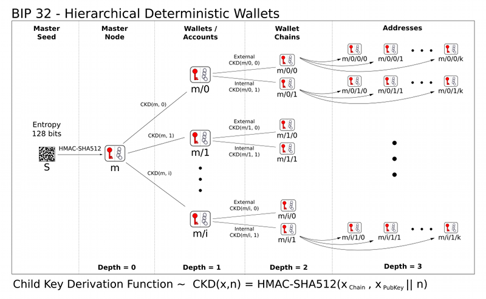

# web3.py极简入门: 14. 批量生成钱包
**WTF Academy社群：** [官网 wtf.academy](https://wtf.academy) | [WTF Solidity教程](https://github.com/AmazingAng/WTF-Solidity) | [discord](https://discord.gg/5akcruXrsk) | [微信群申请](https://docs.google.com/forms/d/e/1FAIpQLSe4KGT8Sh6sJ7hedQRuIYirOoZK_85miz3dw7vA1-YjodgJ-A/viewform?usp=sf_link)

-----

这一讲，我们将介绍HD钱包，并写一个批量生成钱包的脚本。

## HD钱包

HD钱包（Hierarchical Deterministic Wallet，多层确定性钱包）是一种数字钱包 ，通常用于存储比特币和以太坊等加密货币持有者的数字密钥。通过它，用户可以从一个随机种子创建一系列密钥对，更加便利、安全、隐私。要理解HD钱包，我们需要简单了解比特币的[BIP32](https://github.com/bitcoin/bips/blob/master/bip-0032.mediawiki)，[BIP44](https://github.com/bitcoin/bips/blob/master/bip-0044.mediawiki)，和[BIP39](https://github.com/bitcoin/bips/blob/master/bip-0039.mediawiki)。

### BIP32

在`BIP32`推出之前，用户需要记录一堆的私钥才能管理很多钱包。`BIP32`提出可以用一个随机种子衍生多个私钥，更方便的管理多个钱包。钱包的地址由衍生路径决定，例如`“m/0/0/1”`。



### BIP44

`BIP44`为`BIP32`的衍生路径提供了一套通用规范，适配比特币、以太坊等多链。这一套规范包含六级，每级之间用"/"分割：
```
m / purpose' / coin_type' / account' / change / address_index
```
其中：
- m: 固定为"m"
- purpose：固定为"44"
- coin_type：代币类型，比特币主网为0，比特币测试网为1，以太坊主网为60
- account：账户索引，从0开始。
- change：是否为外部链，0为外部链，1为内部链，一般填0.
- address_index：地址索引，从0开始，想生成新地址就把这里改为1，2，3。

举个例子，以太坊的默认衍生路径为`"m/44'/60'/0'/0/0"`。

### BIP39

`BIP39`让用户能以一些人类可记忆的助记词的方式保管私钥，而不是一串16进制的数字：

```
//私钥
0x813f8f0a4df26f6455814fdd07dd2ab2d0e2d13f4d2f3c66e7fd9e3856060f89
//助记词
air organ twist rule prison symptom jazz cheap rather dizzy verb glare jeans orbit weapon universe require tired sing casino business anxiety seminar hunt
```

## 批量生成账户

`web3.py`提供了`create_with_mnemonic`方法，方便开发者创建助记词钱包账户。下面我们利用它从一个助记词批量生成20个钱包。

1. 创建`acct`助记词账户变量，可以看到助记词为`'pink skull pilot peace assist deposit toe recipe clever lunch drum until'`
    ```py
    # 连接到以太坊节点
    infura_url = "https://goerli.infura.io/v3/22b26b228b004ccc9325066db8b5c468"
    w3 = Web3(Web3.HTTPProvider(infura_url))
    # 启用未经审计的 HD 钱包功能
    Account.enable_unaudited_hdwallet_features()
    创建账户并获得其助记词
    acct, mnemonic = Account.create_with_mnemonic()
    print(acct.address)
    print(mnemonic)
    # 验证生成的钱包与生成助记词是否一致
    print(acct == Account.from_mnemonic(mnemonic))
    ```
    

2. 通过HD钱包派生10个钱包。

    ```py
    # 批量生成钱包
    iterator = 0
    for i in range(10):
        acct = Account.from_mnemonic(mnemonic,
            account_path=f"m/44'/60'/0'/0/{iterator}")
        iterator = iterator + 1
        print("第"+str(i)+"个钱包地址"+acct.address)
    ```
    

3. 保存钱包为加密json：

    ```py
    # 打印钱包账户私钥
    print(acct.key.hex())
    # 加密 JSON 用的密码
    password = "password"
    # 生成加密 JSON
    encrypted_json = Account.encrypt(acct.key.hex(), password)
    json_string = json.dumps(encrypted_json,indent=4)
    print("钱包的加密 JSON：")
    print(json_string)
    ```
    

4. 从加密json中读取钱包：
    ```js
    # 解密 JSON 用的密码
    password = "password"
    # 将加密 JSON 转换为字符串
    json_string = json.dumps(encrypted_json)
    # 从加密 JSON 读取钱包
    private_key = w3.eth.account.decrypt(json_string, password)
    print("从加密 JSON 读取账户私钥：")
    print(private_key.hex())
    ```
    

## 总结
这一讲我们介绍了HD钱包（BIP32，BIP44，BIP39），并利用它使用`web3.py`批量生成了10个钱包。
