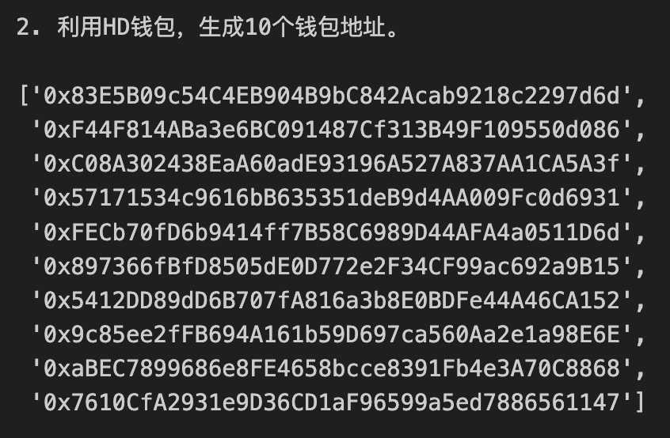

# web3.py极简入门: 15. 批量转账

我最近在重新学`web3.py`，巩固一下细节，也写一个`WTF web3py极简入门`，供小白们使用。

**推特**：[@0xAA_Science](https://twitter.com/0xAA_Science), [0xXQ](https://twitter.com/0xXQ1)

**WTF Academy社群：** [官网 wtf.academy](https://wtf.academy) | [WTF Solidity教程](https://github.com/AmazingAng/WTF-Solidity) | [discord](https://discord.gg/5akcruXrsk) | [微信群申请](https://docs.google.com/forms/d/e/1FAIpQLSe4KGT8Sh6sJ7hedQRuIYirOoZK_85miz3dw7vA1-YjodgJ-A/viewform?usp=sf_link)

所有代码和教程开源在github: [github.com/WTFAcademy/WTF-web3py](https://github.com/WTFAcademy/WTF-web3py)

-----

这一讲，我们将介绍用`web3.py`进行批量转账。通过调用[WTF Solidity极简入门第33讲：空投](https://github.com/AmazingAng/WTF-Solidity/blob/main/33_Airdrop/readme.md)中的`Airdrop`合约，可以在一笔交易中实现批量转账，节省gas费。

## Airdrop合约

这里简单介绍下`Airdrop`合约，细节可以去Solidity教程中看。我们会用到`1`个函数：

- `multiTransferETH()`：批量发送`ETH`，包含`2`个参数：
    - `_addresses`：接收空投的用户地址数组（`address[]`类型）
    - `_amounts`：空投数量数组，对应`_addresses`里每个地址的数量（`uint[]`类型）


我们在`Goerli`测试网部署了一个`Airdrop`合约，地址为：
```
0x71C2aD976210264ff0468d43b198FD69772A25fa
```

## 批量转账

下面我们写一个脚本，调用`Airdrop`合约将`ETH`（原生代币）转账给`10`个地址。

1. 创建HD钱包，用于批量生成地址。
    ```python
    # 1. 创建HD钱包，用于批量生成地址。
    print("1. 创建HD钱包，用于批量生成地址。")

    from web3 import Web3
    w3 = Web3(Web3.HTTPProvider('https://goerli.infura.io/v3/5be23a050401499fb951be2e12178e01'))
    # test mnemonic from ganache (don't use it!)
    mnemonic = "air organ twist rule prison symptom jazz cheap rather dizzy verb glare jeans orbit weapon universe require tired sing casino business anxiety seminar hunt"
    w3.eth.account.enable_unaudited_hdwallet_features()
    ```

2. 利用HD钱包，生成10个钱包地址。
    ```python
    # 2. 利用HD钱包，生成10个钱包地址。
    print("2. 利用HD钱包，生成10个钱包地址。")

    addresses = []
    for i in range(10):
        address = w3.eth.account.from_mnemonic(mnemonic, account_path=f"m/44'/60'/0'/0/{i}")
        addresses.append(address.address)
    print(addresses)
    ```
    

3. 创建provider和wallet，发送代币用。

    ```python
    # 3. 创建wallet，发送代币用。
    print("3. 创建wallet，发送代币用。")

    private_key = "这里填写你自己的私钥"
    account = w3.eth.account.from_key(private_key)
    account.address
    ```

4. 创建Airdrop合约。
    ```python
    # 4. 创建Airdrop合约。
    print("4. 创建Airdrop合约。")

    # 合约 abi
    airdrop_abi = '[{"inputs":[{"internalType":"uint256[]","name":"_arr","type":"uint256[]"}],"name":"getSum","outputs":[{"internalType":"uint256","name":"sum","type":"uint256"}],"stateMutability":"pure","type":"function"},{"inputs":[{"internalType":"address payable[]","name":"_addresses","type":"address[]"},{"internalType":"uint256[]","name":"_amounts","type":"uint256[]"}],"name":"multiTransferETH","outputs":[],"stateMutability":"payable","type":"function"},{"inputs":[{"internalType":"address","name":"_token","type":"address"},{"internalType":"address[]","name":"_addresses","type":"address[]"},{"internalType":"uint256[]","name":"_amounts","type":"uint256[]"}],"name":"multiTransferToken","outputs":[],"stateMutability":"nonpayable","type":"function"}]'

    # 合约地址 测试网
    airdrop_address = '0x71C2aD976210264ff0468d43b198FD69772A25fa'

    # 创建合约实例
    airdrop_contract = w3.eth.contract(address=airdrop_address, abi=airdrop_abi)
    ```

5. 读取一个地址的ETH余额。
    ```python
    # 5. 读取一个地址的ETH余额。
    print("5. 读取一个地址的ETH余额。")

    # 目标地址
    target_address = addresses[8]

    # 读取 ETH 余额
    balanceETH = w3.eth.get_balance(target_address)

    print(balanceETH)
    ```
    


6. 调用`multiTransferETH()`函数，给每个钱包转`0.0001 ETH`，可以看到发送后余额发生变化。
    ```python
    # 6. 调用multiTransferETH()函数，给每个钱包转 0.0001 ETH
    print("6. 调用multiTransferETH()函数，给每个钱包转 0.0001 ETH")

    # 发起交易
    amounts = (len(addresses)) * [w3.to_wei(0.0001, 'ether')]
    # 调用方法
    tx = airdrop_contract.functions.multiTransferETH(addresses, amounts).build_transaction({
        'from': account.address,
        'value': w3.to_wei(0.001, 'ether'),
        'gas': 2000000,  # 根据需要调整
        'nonce': w3.eth.get_transaction_count(account.address)
    })

    # 发起交易
    signed_tx = w3.eth.account.sign_transaction(tx, private_key=private_key)
    tx_hash = w3.eth.send_raw_transaction(signed_tx.rawTransaction)

    # 等待交易上链
    tx_receipt = w3.eth.wait_for_transaction_receipt(tx_hash)

    balanceETH2 = w3.eth.get_balance(addresses[8])
    print("转账后余额：", balanceETH2)
    ```
    


## 总结

这一讲，我们介绍了如何利用`ethers.js`调用`Airdrop`合约进行批量转账。在例子中，我们将`ETH`发送给了`10`个不同地址，省事且省钱（gas费）。