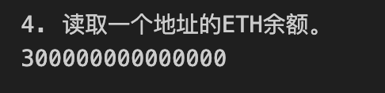

# Ethers极简入门: 16. 批量归集

我最近在重新学`web3.py`，巩固一下细节，也写一个`WTF web3py极简入门`，供小白们使用。

**推特**：[@0xAA_Science](https://twitter.com/0xAA_Science), [0xXQ](https://twitter.com/0xXQ1)

**WTF Academy社群：** [官网 wtf.academy](https://wtf.academy) | [WTF Solidity教程](https://github.com/AmazingAng/WTF-Solidity) | [discord](https://discord.gg/5akcruXrsk) | [微信群申请](https://docs.google.com/forms/d/e/1FAIpQLSe4KGT8Sh6sJ7hedQRuIYirOoZK_85miz3dw7vA1-YjodgJ-A/viewform?usp=sf_link)

所有代码和教程开源在github: [github.com/WTFAcademy/WTF-web3py](https://github.com/WTFAcademy/WTF-web3py)

-----

这一讲，我们介绍如何使用`web3.py`将多个钱包的`ETH`和代币归集到一个钱包中。

## 批量归集

在链上交互、撸毛之后，就需要将多个钱包的资产进行归集管理。你可以用[HD钱包](https://github.com/WTFAcademy/WTF-web3py/blob/main/14_HDwallet/readme.md)或者保存多份密钥的方式操作多个钱包，然后用`web3.py`脚本完成归集。下面我们分别示范归集`ETH`（原生代币）和`WETH`（ERC20代币）。

1. 创建`provider`和`wallet`，其中`wallet`是接收资产的钱包。

    ```python
    # 1. 创建provider和wallet，其中wallet是接收资产的钱包。
    print("1. 创建provider和wallet，其中wallet是接收资产的钱包。")

    from web3 import Web3
    w3 = Web3(Web3.HTTPProvider('https://goerli.infura.io/v3/5be23a050401499fb951be2e12178e01'))

    private_key = "0x21ac72b6ce19661adf31ef0d2bf8c3fcad003deee3dc1a1a64f5fa3d6b049c06"
    account = w3.eth.account.from_key(private_key)
    account.address
    ```

    


2. 创建`HD`钱包，用于管理多个钱包。

    ```python
    # 2. 创建HD钱包，用于管理多个钱包。
    print("2. 创建HD钱包，用于管理多个钱包。")

    mnemonic = "air organ twist rule prison symptom jazz cheap rather dizzy verb glare jeans orbit weapon universe require tired sing casino business anxiety seminar hunt"
    w3.eth.account.enable_unaudited_hdwallet_features()

    ```

3. 通过`HD`钱包衍生`10`个钱包，这些钱包上需要有资产。

    ```python
    # 3. 利用HD钱包，生成10个钱包地址。
    print("3. 利用HD钱包，生成10个钱包地址。")

    addresses = []
    for i in range(10):
        address = w3.eth.account.from_mnemonic(mnemonic, account_path=f"m/44'/60'/0'/0/{i}")
        addresses.append(address)
    addresses
    ```
    

4. 读取一个地址的ETH余额。

    ```python
    # 4. 读取一个地址的ETH余额。
    print("4. 读取一个地址的ETH余额。")

    # 目标地址
    target_address = addresses[3]

    # 读取 ETH 余额
    balanceETH = w3.eth.get_balance(target_address)

    print(balanceETH)
    ```
    

5. 利用钱包类的`send_raw_transaction()`发送交易，归集每个钱包中的`ETH`。

    ```python
    # 5. 利用钱包类的send_raw_transaction()发送交易，归集每个钱包中的ETH。
    print("5. 利用钱包类的send_raw_transaction()发送交易，归集每个钱包中的ETH。")

    for i in range(10):
        # 设置钱包私钥
        wallet = w3.eth.account.from_key(addresses[i].key)

        # 准备交易数据
        tx = {
            'to': account.address,
            'value': w3.to_wei(0.0001, "ether"),
            'gas': 2000000,  
            'nonce': w3.eth.get_transaction_count(addresses[i].address),
            'gasPrice': w3.eth.gas_price
        }

        # 签名并发送交易
        signed_tx = wallet.sign_transaction(tx)
        tx_hash = w3.eth.send_raw_transaction(signed_tx.rawTransaction)
        tx_receipt = w3.eth.wait_for_transaction_receipt(tx_hash)

        print(f"第 {i+1} 个钱包 {addresses[i].address} ETH 归集开始")

    print("ETH 归集结束")
    ```
    


6. 读取一个地址在归集后的ETH和WETH余额，可以看到`ETH`和`WETH`余额减少，归集成功！
    ```python
    # 6. 读取一个地址在归集后的ETH和WETH余额，可以看到ETH和WETH余额减少，归集成功！
    print("6. 读取一个地址在归集后的ETH和WETH余额，可以看到ETH和WETH余额减少，归集成功！")
    balanceETH2 = w3.eth.get_balance(addresses[3].address)
    print("转账后余额：", balanceETH2)
    ```
    

## 总结

这一讲，我们介绍了批量归集，并用`web3.py`脚本将`10`个钱包的`ETH`归集到一个钱包中。