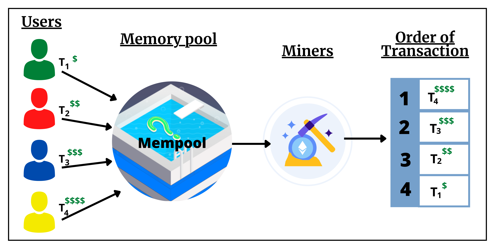
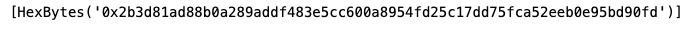
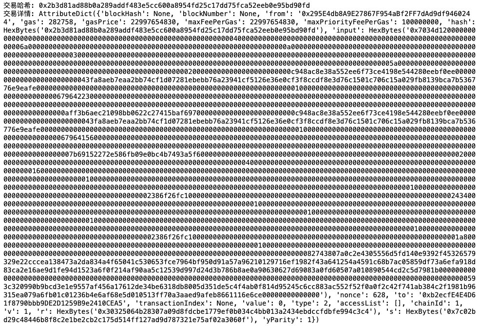

# web3.py极简入门: 19、监听Mempool

我们最近在重新学`web3.py`，巩固一下细节，也写一个`WTF web3.py极简入门`，供小白们使用。

**推特**：[@0xAA_Science](https://twitter.com/0xAA_Science)   [@localcat15](https://twitter.com/localcat15)


**WTF Academy社群：** [官网 wtf.academy](https://wtf.academy) | [WTF Solidity教程](https://github.com/AmazingAng/WTFSolidity) | [discord](https://discord.gg/5akcruXrsk) | [微信群申请](https://docs.google.com/forms/d/e/1FAIpQLSe4KGT8Sh6sJ7hedQRuIYirOoZK_85miz3dw7vA1-YjodgJ-A/viewform?usp=sf_link)

所有代码和教程开源在github: [github.com/WTFAcademy/WTF-web3py](https://github.com/WTFAcademy/WTF-web3py)

-----

这一讲，我们会介绍如何监听`mempool`（交易内存池）中的交易.

## Mempool
以太坊的内存池（Mempool）存储尚未被打包进区块的交易队列。当用户发起一笔以太坊交易时，该交易首先会被广播到网络中的节点，然后被放入内存池等待被矿工打包确认。

一般而言，矿工更愿意打包那些支付更高Gas价格的交易，因为这样他们能够获取更高的利润。在常见的代币IDO、NFT打新、铭文打新等场景中，项目方常常设置“先到先得”机制，先上链的交易才有资格获得奖励，因此科学家们常常会进行Gas War,投入几倍乃至几十倍于平均水平的gas费，或者通过其它手段直接贿赂矿工，从而让自己`mempool`中的交易能够更快的被打包上链。

此外，大家熟悉的三明治攻击也是通过监听并抢跑`mempool`中的交易实现的。

## 监听Mempool
下面我们实现一个监听Mempool的简单脚本：

1、创建`Provider`。这里需要注意：并非所有RPC节点都能够支持对`mempool`进行实时查询，如果后续出现错误，可以尝试更换RPC。
```python
from web3 import Web3
# 申请自己的RPC-URL
ALCHEMY_MAINNET_URL = 'https://eth-mainnet.g.alchemy.com/v2/hjZ-SwVhjRtBk-yUJ1SkWSTrz_dJl7of'
# 创建Provider
w3 = Web3(Web3.HTTPProvider(ALCHEMY_MAINNET_URL))
```
2、创建用于监控`mempool`的过滤器，不同于之前章节中的情形，这里只需要将参数设置为`pending`即可。
```python
#创建过滤器
pending_tx_filter= w3.eth.filter('pending')
#获取pending交易并打印
pending_tx = pending_tx_filter.get_new_entries()
print(pending_tx)
```


3、为了获取mempool中交易的更详细信息，我们可以把上面获取到的哈希传入`get_transaction`函数，返回值是一个字典，包含交易的发送方、接收方、gas费等信息。
```python
for hash in pending_tx:
    print('交易哈希:' , hash.hex())
    print('交易详情:',w3.eth.get_transaction(hash.hex()))
```

可以看到上述哈希的`blockNumber`和`blockHash`均为空，这说明我们监听到的交易的确尚未上链。

上述方法有一定实际应用价值：例如在某些出块很慢的链上打张数较少的铭文时，我们不仅需要关注已经上链的交易，还需要关注`mempool`中未上链的部分。通过上述方法找出自转或转给特定合约的交易，统计这些交易的gas情况，我们就能够更好的评估剩余的铭文张数，并能够灵活调整Gas进行抢跑。


## 总结
这一讲，我们简单介绍了`mempool`，并写了一个脚本实现对`mempool`的监听。