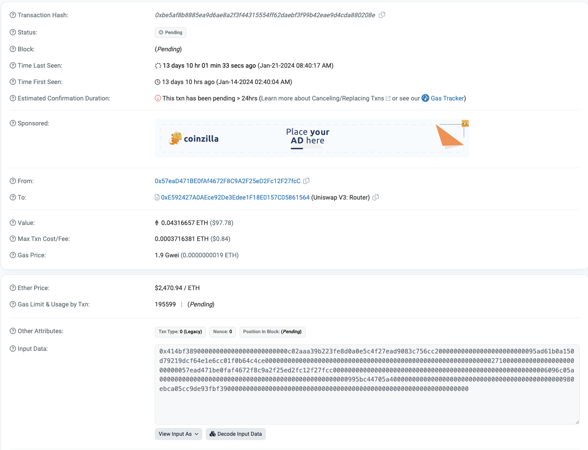
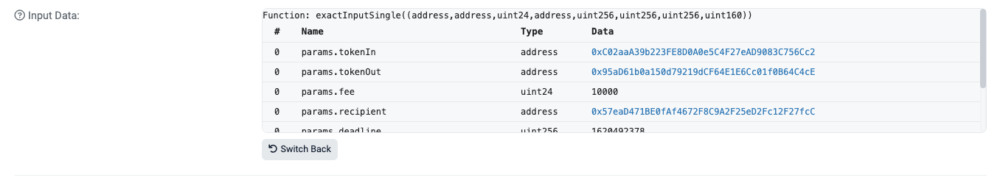
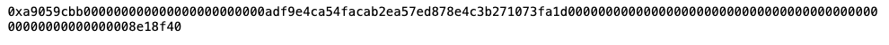
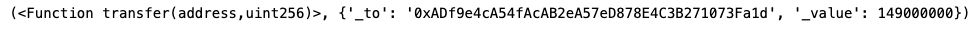

# web3.py极简入门: 20、解码交易详情

我们最近在重新学`web3.py`，巩固一下细节，也写一个`WTF web3.py极简入门`，供小白们使用。

**推特**：[@0xAA_Science](https://twitter.com/0xAA_Science)   [@localcat15](https://twitter.com/localcat15)


**WTF Academy社群：** [官网 wtf.academy](https://wtf.academy) | [WTF Solidity教程](https://github.com/AmazingAng/WTFSolidity) | [discord](https://discord.gg/5akcruXrsk) | [微信群申请](https://docs.google.com/forms/d/e/1FAIpQLSe4KGT8Sh6sJ7hedQRuIYirOoZK_85miz3dw7vA1-YjodgJ-A/viewform?usp=sf_link)

所有代码和教程开源在github: [github.com/WTFAcademy/WTF-web3py](https://github.com/WTFAcademy/WTF-web3py)

-----

这一讲，我们介绍如何解码调用智能合约时发送的`calldata`。

## Calldata
当我们调用智能合约时，本质上是向目标合约发送了一段`calldata`，`calldata`大致由两个部分组成：前4个字节代表`selector`函数选择器，旨在告诉智能合约我要调用哪个函数；而后面的字节则代表传递给函数的参数。

有关`calldata`和`selector`的详细介绍请参考[Solidity极简入门: 29. 函数选择器Selector](https://www.wtf.academy/solidity-advanced/Selector)。

下面是一笔在`Uniswap`上进行代币置换的交易，可以通过[etherscan](https://etherscan.io/tx/0xbe5af8b8885ea9d6ae8a2f3f44315554ff62daebf3f99b42eae9d4cda880208e)查看交易详情:

最下面`Input Data`框中的16进制数就是我们所说的`calldata`。在`etherscan`中点击旁边的**Decode Input Data**按钮，即可对交易数据进行解码，结果如下：

可以看到，通过解码`calldata`，我们的确得到了函数名和具体的函数参数。
## 解码交易数据
在`web3.py`中解码`calldata`非常简单，只需借助`Contract.decode_function_input`函数，下面我们将展示其具体过程：

1、创建`provider`。
```python
from web3 import Web3
ALCHEMY_MAINNET_URL = 'https://eth-mainnet.g.alchemy.com/v2/hjZ-SwVhjRtBk-yUJ1SkWSTrz_dJl7of'
w3 = Web3(Web3.HTTPProvider(ALCHEMY_MAINNET_URL))
```
2、我们随机选取一笔与`USDT`合约进行交互的交易，获取其`calldata`。
```python
transaction = w3.eth.get_transaction('0x6b2eba89b78484f6b954cf74f35ee42667363f65c0927d46b5f10ef6ab894393')
#打印出calldata
print(transaction.input.hex())
```

3、将`USDT`合约实例化，用于解码交易详情。
```python
#USDT合约地址
addressUSDT='0xdAC17F958D2ee523a2206206994597C13D831ec7'
#USDT合约ABI
abiUSDT='[{"constant":true,"inputs":[],"name":"name","outputs":[{"name":"","type":"string"}],"payable":false,...'
#实例化合约
contractUSDT=w3.eth.contract(address=addressUSDT,abi=abiUSDT)
```
4、解码之前获取到的`calldata`。
```python
print(contractUSDT.decode_function_input(transaction.input))
```

可以得知，之前随机选取的交易是一笔转账交易，金额为149`USDT`。
## 总结
这一讲，我们介绍了如何解码`calldata`，并给出了一个实例。