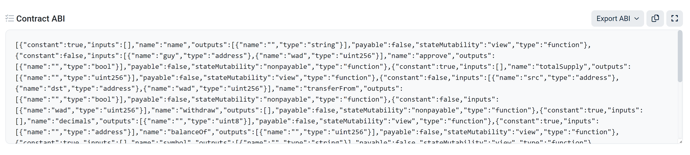
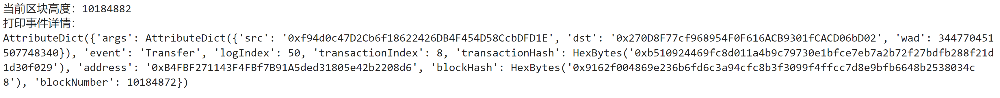
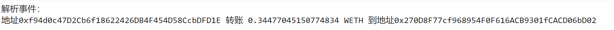
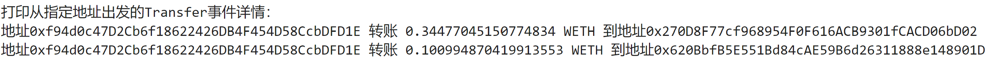

# web3py极简入门: 7. 检索事件

我最近在重新学 `web3.py`，巩固一下细节，也写一个 `WTF web3py极简入门`，供小白们使用。

**推特**：[@0xAA_Science](https://twitter.com/0xAA_Science)

**WTF Academy社群：** [官网 wtf.academy](https://wtf.academy) | [WTF Solidity教程](https://github.com/AmazingAng/WTF-Solidity) | [discord](https://discord.gg/5akcruXrsk) | [微信群申请](https://docs.google.com/forms/d/e/1FAIpQLSe4KGT8Sh6sJ7hedQRuIYirOoZK_85miz3dw7vA1-YjodgJ-A/viewform?usp=sf_link)

所有代码和教程开源在github: [github.com/WTFAcademy/WTF-web3py](https://github.com/WTFAcademy/WTF-web3py)

---

提示：本教程基于web3.py v6.6.0 ，可以参考[web3.py 官方文档](https://web3py.readthedocs.io/en/stable/)。

这一讲，我们将介绍如何使用 `web3.py`读取智能合约释放的事件。如果你不了解 `Solidity`的事件，可以阅读WTF Solidity极简教程中[第12讲：事件](https://github.com/AmazingAng/WTFSolidity/blob/main/12_Event/readme.md)。

具体可参考[web3.py文档](https://web3py.readthedocs.io/en/stable/web3.contract.html#events)。

## 事件 Event

智能合约释放出的事件存储于以太坊虚拟机的日志中。日志分为两个主题 `topics`和数据 `data`部分，其中事件哈希和 `indexed`变量存储在 `topics`中，作为索引方便以后搜索；没有 `indexed`变量存储在 `data`中，不能被直接检索，但可以存储更复杂的数据结构。

以ERC20代币中的 `Transfer`转账事件为例，在合约中它是这样声明的：

```solidity
event Transfer(address indexed from, address indexed to, uint256 amount);
```

它共记录了3个变量 `from`，`to`和 `amount`，分别对应代币的发出地址，接收地址和转账数量，其中 `from`和 `to`前面带有 `indexed`关键字。转账时，`Transfer`事件会被记录，可以在 `etherscan`中[查到](https://rinkeby.etherscan.io/tx/0x8cf87215b23055896d93004112bbd8ab754f081b4491cb48c37592ca8f8a36c7)。


从上图中可以看到，`Transfer`事件被记录到了EVM的日志中，其中 `Topics`包含3个数据，分别对应事件哈希，发出地址 `from`，和接收地址 `to`；而 `Data`中包含一个数据，对应转账数额 `amount`。

## 检索事件

`web3.py`中，通过 `web3.contract.ContractEvents`类，我们可以与合约中指定的事件进行交互，其中的 `get_logs()`方法提供了读取合约释放事件的接口，我们可以通过 `Contract`类的 `events`属性来得到指定合约的 `ContractEvents`实例，进而针对不同的事件调用 `get_logs()`进行检索，具体用法如下：

```python
eventsLog = 合约实例.events.事件名.get_logs(fromBlock = 起始区块, toBlock = 结束区块, argument_filters = 事件参数键值对)
```

其中事件名代表要检索的事件名称；`get_logs()`包含3个参数，分别是起始区块 `fromBlock`（选填），结束区块 `toBlock`（选填），事件参数键值对 `argument_filters`（选填），其中 `argument_filters`针对事件参数对检索结果进行过滤；检索结果会以 `元组（tuple）`的方式返回，每个元素对应一次事件释放的信息。

**注意**：要检索的事件必须包含在合约的 `abi`中。

## 例子：检索 `WETH`合约中的 `Transfer`事件

1. 创建 `provider`。

   ```Python
   from web3 import Web3
   # 利用Infura的rpc节点连接以太坊网络
   # 准备 infura API 可以参考https://github.com/AmazingAng/WTF-Solidity/tree/main/Topics/Tools/TOOL02_Infura/readme.md
   INFURA_GEORLI_URL = 'https://goerli.infura.io/v3/5cd64b21ee2e4a1fa149862681338bbf' 
   Provider = Web3(Web3.HTTPProvider(INFURA_GEORLI_URL))
   Provider.is_connected()
   ```
2. 定义合约地址与合约 `abi`

该合约的abi可以由[etherscan](https://goerli.etherscan.io/address/0xb4fbf271143f4fbf7b91a5ded31805e42b2208d6#code)中的Contract ABI复制得到。

```Python
# 测试网络WETH地址
addressWETH = Provider.to_checksum_address('0xb4fbf271143f4fbf7b91a5ded31805e42b2208d6')
# WETH合约abi
abiWETH = '[{"constant":true,"inputs":[],"name":"name","outputs":[{"name":"","type":"string"}],...太长后面省略...'
```



3. 声明 `WETH`合约实例。

   ```python
   WETHcontract = Provider.eth.contract(address=addressWETH,abi=abiWETH)
   ```
4. 获取过去10个区块内的 `Transfer`事件，并打印出第一个。我们可以看到，`args`中有3个数据，分别对应 `src`，`dst`和 `wad`。

   ```python
   # 得到当前block
   block = Provider.eth.block_number
   print(f"当前区块高度：{block}")
   print("打印事件详情：")
   logs = WETHcontract.events.Transfer.get_logs(fromBlock=block-10, toBlock=block)
   print(logs[0])
   ```

   
5. 读取事件的解析结果。

   ```python
   # 解析Transfer事件的数据（变量在args中）
   print("解析事件：")
   print(f"地址{logs[0].args.src} 转账 {Provider.from_wei(logs[0].args.wad, 'ether')} WETH 到地址{logs[0].args.dst}")
   ```

   
6. 利用argument_filters参数过滤事件

   ```PYTHON
   # 读取所有src地址为指定地址的Transfer事件，输出解析后的事件
   filteredLogs = WETHcontract.events.Transfer.get_logs(fromBlock=block-10, toBlock=block,argument_filters={'src':logs[0].args.src})
   print("打印从指定地址出发的Transfer事件详情：")
   for l in filteredLogs:
       print(f"地址{l.args.src} 转账 {Provider.from_wei(l.args.wad, 'ether')} WETH 到地址{l.args.dst}")
   ```

   

## 总结

这一讲，我们回顾了 `Solidity`中的事件，介绍如何用 `web3.py`检索智能合约释放的事件，并介绍了一种过滤事件的方法。
