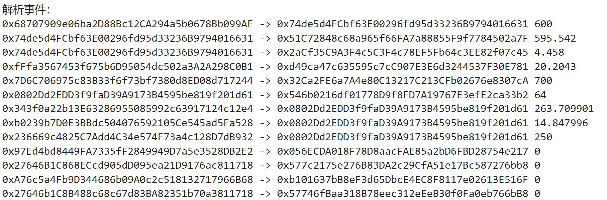

# web3py极简入门: 8. 监听合约事件

我最近在重新学 `web3.py`，巩固一下细节，也写一个 `WTF web3py极简入门`，供小白们使用。

**推特**：[@0xAA_Science](https://twitter.com/0xAA_Science)

**WTF Academy社群：** [官网 wtf.academy](https://wtf.academy) | [WTF Solidity教程](https://github.com/AmazingAng/WTF-Solidity) | [discord](https://discord.gg/5akcruXrsk) | [微信群申请](https://docs.google.com/forms/d/e/1FAIpQLSe4KGT8Sh6sJ7hedQRuIYirOoZK_85miz3dw7vA1-YjodgJ-A/viewform?usp=sf_link)

所有代码和教程开源在github: [github.com/WTFAcademy/WTF-web3py](https://github.com/WTFAcademy/WTF-web3py)

提示：本教程基于web3.py v6.6.0 ，可以参考[web3.py 官方文档](https://web3py.readthedocs.io/en/stable/)。

这一讲，我们将介绍如何监听合约，并实现监听 `USDT`合约的 `Transfer`事件。

具体可参考[web3.py文档](https://web3py.readthedocs.io/en/stable/filters.html#examples-listening-for-events)。

## 通过合约事件创建事件过滤器

在 `web3.py`中，事件的监听需要通过过滤器 `filter`来完成，过滤器的详细介绍可以参见下一节，本节只介绍如何通过 `web3.contract.ContractEvents`对象创建事件过滤器

```PYTHON
eventFilter = 合约实例.events.事件名称.create_filter(fromBlock=起始区块,toBlock = 终止区块, argument_filters = 事件参数键值对, topics = 主题集过滤条件)
```

`create_filter()`包含四个参数，分别是起始区块 `fromBlock`（必填），结束区块 `toBlock`（选填），事件参数键值对 `argument_filters`（选填），主题集过滤条件 `topics`（选填）

- `fromBlock`和 `toBlock`可以是区块编号，也可以是字符串 `latest`（区块链的当前最新块），`earliest`（创世块），`pending`（正在挖掘的块），后续例子中我们将使用 `pending`来进行事件的实时监听。
- `argument_filters`针对事件参数，对检索结果进行过滤。
- `topics`针对事件主题集进行过滤，关于该参数的使用，可以参考[Ethers极简入门: 8. 监听合约事件](https://github.com/WTFAcademy/WTF-Ethers/tree/main/09_EventFilter)中的介绍

**注意**：起始区块 `fromBlock`是必填项。

## 利用事件过滤器接口监听事件

通过调用事件过滤器的 `get_new_entries()`方法，我们可以在 `[起始区块，结束区块]`的范围内，监听自上次 `轮询（polling）`以来的所有新释放的事件

```python
eventFilter.get_new_entries()
```

这个函数不需要任何参数，因为所有参数在定义事件过滤器 `eventFilter`时已经确定，函数的返回结果是一个 `列表`，每个元素对应一次事件释放的信息。

## 监听 `USDT`合约的 `Transfer`事件

1. 声明 `Provider`

要想和链上信息交互，首先需要声明 `Provider`，这里使用节点供应商Alchemy的节点API，关于如何申请，可以参考[Solidity极简入门-工具篇4：Alchemy](https://github.com/AmazingAng/WTF-Solidity/blob/main/Topics/Tools/TOOL04_Alchemy/readme.md)

```python
from web3 import Web3
# 准备 alchemy API 
# 可以参考https://github.com/AmazingAng/WTFSolidity/blob/main/Topics/Tools/TOOL04_Alchemy/readme.md 
ALCHEMY_MAINNET_URL = 'https://eth-mainnet.g.alchemy.com/v2/oKmOQKbneVkxgHZfibs-iFhIlIAl6HDN'
Provider = Web3(Web3.HTTPProvider(ALCHEMY_MAINNET_URL))
Provider.is_connected()
```

2. 定义合约地址和合约 `abi`

该合约的abi可以由[etherscan](https://etherscan.io/address/0xdac17f958d2ee523a2206206994597c13d831ec7#code)中的Contract ABI复制得到。

```PYTHON
# 定义合约地址
contractAddress = Provider.to_checksum_address('0xdac17f958d2ee523a2206206994597c13d831ec7')
# 定义合约abi
contractABI = '[{"constant":true,"inputs":[],"name":"name","outputs"...后面太长所以省略...'
```

3. 创建合约实例与事件过滤器实例

```python
# 创建合约实例
USDTcontract = Provider.eth.contract(address = contractAddress, abi = contractABI)
# 创建事件过滤器实例
event_filter = USDTcontract.events.Transfer.create_filter(fromBlock="pending",toBlock="pending")
```

4. 监听 `USDT`合约的 `Transfer`事件

```PYTHON
import time
print("解析事件：")
start = time.time()
# 通过循环，监听事件，持续25秒
while True and (time.time() - start) < 25:
    # 通过循环，持续监听事件
    newEvent = event_filter.get_new_entries()
    # 判断是否有新的事件被释放
    if len(newEvent) :
        # 提取监听到的事件，并进行解析
        for log in newEvent:
            print(f"{log.args["from"]} -> {log.args["to"]} {Provider.from_wei(log.args["value"], "mwei")}")
    # 控制监听间隔
    time.sleep(1)
```



## 总结

这一讲，我们介绍了利用 `web3.py`中 `filter`类的 `get_new_entries()`接口，进行简单的链上监听功能。通过上述方法，你可以监听指定合约的指定事件。
